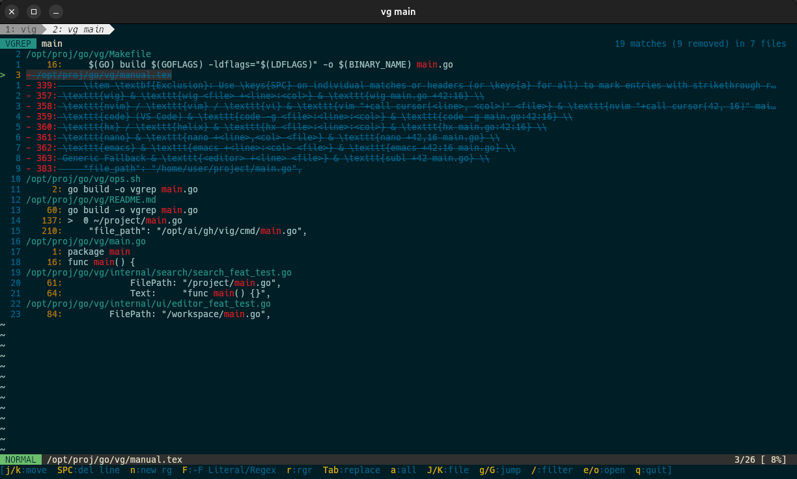

# vgrep

A blazing-fast, project-aware interactive CLI search tool built on top of [ripgrep (`rg`)](https://github.com/BurntSushi/ripgrep).

`vgrep` bridges the gap between searching code and editing it by providing **Vim-motion navigation**, **scoped project history recall**, **on-the-fly ripgrep queries (`n`)**, **in-app & external find-and-replace**, and direct session integration with editors like **`wig`**, **`nvim`**, and **`vim`**.

<p align="center">
  
</p>

---

## Problem Statement

Developers constantly search code from the terminal, but traditional CLI search workflows suffer from two major friction points:

### 1. Quoting & Shell Expansion Friction
Running searches directly from shells (`bash`, `zsh`) often turns into a frustrating battle with quote and space parsing:
- **Eaten Quotes (`'` and `"`)**: Shell interpreters strip or expand single and double quotes before passing arguments. Searching for code snippets with quotes (e.g., `{"key": "value"}` or `'foo'`) requires tedious escaping (`\"`, `\'`).
- **Word-Splitting on Spaces**: Phrases containing spaces (e.g., `const x = "bar"`) trigger unintentional word-splitting unless wrapped in nested quotes.
- **Accidental Shell Expansions**: Characters like `$`, `!`, `\`, and `` ` `` trigger shell variable or history expansions unless painstakingly escaped.

### 2. Search Reuse Friction & Disconnected Editor Handoff
Traditional terminal searches (`rg pattern`) output static text lines into your scrollback buffer, breaking workflow momentum:
- **Tedious Copy-Paste Launching**: To inspect a match, you must manually copy or retype the file path and line number into your shell (`$EDITOR path/to/file.go +42`).
- **Context Lost After Editing**: When you exit your editor, you are back at a bare shell prompt. You cannot easily jump to the next match or file without scrolling through terminal history.
- **Wasteful Re-Scanning**: Re-inspecting the same search results minutes later requires re-running `ripgrep` across the entire codebase from scratch, wasting CPU and disk I/O.
- **Isolated CLI & Editor States**: Standalone CLI searches don't synchronize with editor quickfix lists, leaving terminal and editor states disconnected.

---

### How `vgrep` Solves This

- 🔄 **Instant Search Result Reuse (`-v` / `--view`)**: Every search automatically caches structured results to a shared session file (`~/.config/wig/rg_search.json`). Run `vgrep -v` anytime to immediately reopen your last search session with zero re-scanning overhead.
- 🚀 **1-Keystroke Editor Handoff & Auto-Return**: Press `<Enter>`, `o`, or `e` on any match to jump straight into your `$EDITOR` positioned at the **exact line and column**. When you exit (`:q`), you return immediately back to your interactive search list with your cursor position intact.
- ⚡ **Auto-Jump on Single Match**: If a query yields exactly one match across the codebase, `vgrep` bypasses the TUI entirely and opens your editor directly at that location.
- 💡 **Direct In-TUI Input (`n`)**: Press `n` in the TUI to open an interactive prompt that reads in raw terminal mode. You can freely type spaces, single quotes (`'`), double quotes (`"`), backslashes, and regex characters without worrying about shell scripts or command-line parsers eating them.
- 🔤 **Instant Case Sensitivity Toggle (`Alt+i`)**: Press `Alt+i` while typing in the `n` prompt or in normal mode to switch between case-sensitive and case-insensitive (`-i`) search instantly.
- 🔲 **Literal Mode Toggle (`F`)**: Toggle fixed strings mode (`-F`) on the fly to search symbols like `[`, `]`, `(`, `)`, and `.` literally without regex escaping.
- 🧠 **Frictionless History Recall**: Revisit past searches containing quotes or spaces directly from the project history picker without re-typing or re-escaping them in your shell, with option `[0]` to resume your previous session.
- 🔄 **Editor Quickfix Synchronization**: Matches are exported in clean JSON format for seamless loading into editors like `wig` for in-editor quickfix navigation (`:cnext` / `:cprev`).
- 🔁 **Continuous Workflow**: Stay inside your interactive search session rather than jumping back and forth to a shell prompt.

---

## Features

- ⚡ **Powered by `ripgrep`**: Instant search with automatic `.gitignore` parsing, pruning of build/target directories, and multi-threaded traversal.
- 🎯 **Vim-Motion TUI**: Navigate search results using relative line numbers, counts (e.g., `3j`, `5k`), file-aware jumps (`J`/`K`), live filtering (`/`), and return right back to your search list after `:q` in your editor.
- 🔍 **New Search On-the-Fly (`n`)**: Press `n` anytime in the TUI to open an interactive prompt and run a new ripgrep query without exiting.
- 🔲 **Literal Mode (`F` / `-F`)**: Toggle between regex and literal string matching on the fly.
- ✏️ **Built-in Find & Replace (`R` / `Tab`)**: Interactive in-place find and replace with real-time substitution preview, match exclusion toggles (`SPC`, `a`), and batch file updates.
- 🔁 **External Replacer (`r` with `rgr`)**: Press `r` in the TUI to launch [repgrep / `rgr`](https://github.com/acheronfail/repgrep) (automatically hidden if `rgr` is not installed).
- 📍 **Exact Column Positioning**: Jumps directly to the matched word and character column in editors like `wig`, `nvim`, `vim`, `helix`, `vscode`, `nano`, and `emacs`.
- 🩺 **Environment Health Check (`--health`)**: Instantly inspect installed tooling (`rg`, `fzf`, `rgr`, `$EDITOR`, config editor) and configuration paths with clean `~` path abbreviation.
- ⚙️ **Configurable (`~/.config/vgrep/config.toml`)**: Custom default editor, session cache path, and default literal search options.
- 🧠 **Project-Scoped History**: Running `vgrep` without arguments remembers and recalls past search patterns specific to the current Git repository or workspace.
- 📂 **Auto-Detection & Quick Shorthands**:
  - Automatically identifies projects (`go.mod`, `Cargo.toml`, `pyproject.toml`, etc.).
  - Converts shorthand patterns (e.g., `myHandler_fn` $\rightarrow$ `func myHandler` or `fn myHandler`).
- ⚡ **Auto-Jump on Single Match**: Directly opens the editor if the search yields exactly one result.
- 🔄 **`wig` Quickfix Session Synchronization**: Automatically exports search matches to `~/.config/wig/rg_search.json` for editor session sharing.
- 📜 **Review Mode (`-v` / `--view`)**: Revisit and interact with your previous search session without re-scanning the codebase.

---

## Installation

### Prerequisites
- [ripgrep (`rg`)](https://github.com/BurntSushi/ripgrep) (required)
- [repgrep (`rgr`)](https://github.com/acheronfail/repgrep) (optional, enables `r` for advanced regex find & replace)
- [fzf](https://github.com/junegunn/fzf) (optional, for fuzzy history selection)
- An editor like `wig`, `nvim`, or `vim`

### Build from Source
```bash
git clone https://github.com/lecheel/vg.git
cd vgrep
go build -o vgrep main.go
sudo mv vgrep /usr/local/bin/
```

---

## Usage

### 1. Basic Search
Search across the entire project repository:
```bash
vgrep SearchPattern
```
*If only **one match** is found, `vgrep` jumps straight into `$EDITOR +<line>`.*

### 2. Language-Specific Filtering
Filter matches by file extensions:
```bash
vgrep --go MyStruct      # Go files (*.go)
vgrep --rs MyTrait       # Rust files (*.rs)
vgrep --py def           # Python files (*.py)
vgrep --cc MyClass       # C/C++ files (*.c, *.cpp, *.h, *.hpp)
vgrep --dart Widget      # Dart files (*.dart)
vgrep --swift View       # Swift files (*.swift)
```

### 3. Function Search Shorthand
Append `_fn` to quickly search for function definitions:
```bash
vgrep handleRequest_fn
# In Go projects: converts to `func handleRequest`
# In Rust projects: converts to `fn handleRequest`
```

### 4. Interactive Project History
Run `vgrep` without arguments inside any repository to view and select from recent search queries:
```bash
vgrep
```
*Presents an interactive `fzf` or numbered list ranked by frequency and relative recency (e.g., `just now`, `10m ago`, `2d ago`).*

### 5. Review Previous Search Results
Re-open the last search results saved in the session cache without running `rg` again:
```bash
vgrep -v
# or
vgrep --view
```

### 6. Health Check
Check your installed dependencies, editors, and config paths:
```bash
vgrep --health
```

### 7. Edit Configuration
Open `~/.config/vgrep/config.toml` in your `$EDITOR`:
```bash
vgrep -e
# or
vgrep --edit
```

### 8. Clear History & Cache
Wipe project history and cached session files:
```bash
vgrep --init
```

---

## TUI Keyboard Shortcuts & Vim Motions

When multiple matches are found, `vgrep` enters the interactive alternate-screen TUI:

```text
 vgrep  filter: 
>  0 ~/project/main.go
   1     12: func initialize() {
   2     48: func handleRequest() {
   3 ~/project/router.go
   4      8: func registerRoutes() {

[j/k, <num>j/k, J/K (files), g/G, / (filter), r (rgr replace), Enter/o (open), q (quit)]
```

| Key | Action |
|---|---|
| `j` / `k` | Move cursor down / up by 1 row |
| `<num>j` / `<num>k` | Jump down / up by `<num>` rows (e.g., `3j`, `5k`) |
| `J` (`Shift+j`) | Jump to the **first match of the next file** |
| `K` (`Shift+k`) | Jump to the **first match of the previous file** |
| `g` | Jump to top (file header at row 0) |
| `G` | Jump to bottom |
| `/` | Enter live filter mode (shows red block cursor; press `Enter`/`Esc` to exit filter) |
| `r` | Launch `rgr` (repgrep) for interactive search and replace (hidden if `rgr` is not installed) |
| `<Enter>` / `o` | Open file at line in `$EDITOR` (returns back to TUI after `:q`) |
| `q` / `Ctrl+c` | Exit `vgrep` and restore original terminal screen cleanly |

---

## Editor Configuration

### Setting Default Editor
`vgrep` respects the `$EDITOR` environment variable. If unset, it automatically tries `wig` $\rightarrow$ `nvim` $\rightarrow$ `vim`.

Set your preferred editor in your shell profile (`~/.bashrc` or `~/.zshrc`):
```bash
export EDITOR="wig"
# or
export EDITOR="nvim"
```

### `wig` Shared Session Integration
Every search written by `vgrep` is saved to:
```text
~/.config/wig/rg_search.json
```
This enables `wig` to load the exact search result list into its quickfix/search list buffer for in-editor navigation (`:cnext` / `:cprev`).

---

## Session & `rg_search.json` Format

Unlike standard `rg --json` (which emits a stream of newline-delimited JSON events like `begin`, `match`, `end`, and `summary`), `vgrep` aggregates, filters, and transforms results into a **clean root JSON array** stored at `~/.config/wig/rg_search.json`.

```text
[ vgrep query ] ──► [ rg --json -g <globs> <pattern> ]
                             │
                      (NDJSON Stream)
                             │
                             ▼
              [ Decode RgMessage / RgMatchData ]
               - FilePath (normalized to absolute path)
               - LineNumber
               - Submatches[0].Start (character column)
               - Lines.Text (matching line content)
                             │
                             ▼
                 [ Serialize to JSON Array ]
                             │
                             ▼
             ~/.config/wig/rg_search.json
```

### JSON Schema

```json
[
  {
    "file_path": "/opt/ai/gh/vig/cmd/main.go",
    "line": 94,
    "char": 76,
    "text": "\tkeys := wig.NewKeyHandler(config.DefaultKeyMap(editorCfg.Leader, editorCfg.CommentStyle))\n"
  },
  {
    "file_path": "/opt/ai/gh/vig/editor.go",
    "line": 14,
    "char": 1,
    "text": "\tCommentStyle        string `toml:\"comment_style\"`\n"
  }
]
```

### Field Definitions

| Field | Type | Description |
|---|---|---|
| `file_path` | `string` | Fully-qualified absolute path to the file |
| `line` | `int` | 1-based line number of the match |
| `char` | `int` | 0-based character column offset of the match start |
| `text` | `string` | Raw line content (including original whitespace/newlines) |

### Session Re-use (`-v` / `--view`)
When `vgrep -v` is invoked, `vgrep` skips running `ripgrep` entirely and loads this JSON session file directly into the interactive TUI for instant replay and navigation.

---

## Configuration File (`~/.config/vgrep/config.toml`)

```toml
## Configuration File (`~/.config/vgrep/config.toml`)

You can edit your configuration anytime with `vgrep -e` or `vgrep --edit`:

# Preferred editor command (falls back to $EDITOR, wig, nvim, vim)
editor = "wig"

# Custom path to shared search session JSON
session_file = "~/.config/wig/rg_search.json"

# Default literal string search mode (-F)
fixed_strings = false

### Configuration Options

| Option | Type | Default | Description |
|---|---|---|---|
| `editor` | `string` | `"wig"` | Editor binary or path used to open matches |
| `session_file` | `string` | `"~/.config/wig/rg_search.json"` | Shared quickfix session export path (supports `~`) |
| `fixed_strings` | `bool` | `false` | Enable literal match mode (`-F`) by default |
```
---

## Acknowledgements & Citations

`vgrep` stands on the shoulders of remarkable open-source projects. Special thanks to the authors of:

### 1. ripgrep (`rg`)
- **Author**: Andrew Gallant ([@BurntSushi](https://github.com/BurntSushi))
- **Repository**: [https://github.com/BurntSushi/ripgrep](https://github.com/BurntSushi/ripgrep)
- **Role**: `vgrep` relies directly on `ripgrep` as its core search engine, leveraging its blazing speed, multithreaded directory traversal, automatic `.gitignore` parsing, and structured NDJSON output stream.

@software{gallant_ripgrep_2016,
  author       = {Andrew Gallant},
  title        = {ripgrep: A line-oriented search tool that recursively searches directories for a regex pattern},
  year         = {2016},
  publisher    = {GitHub},
  journal      = {GitHub repository},
  howpublished = {\url{https://github.com/BurntSushi/ripgrep}}
}

### 2. repgrep (`rgr`)
- **Author**: [@acheronfail](https://github.com/acheronfail)
- **Repository**: [https://github.com/acheronfail/repgrep](https://github.com/acheronfail/repgrep)
- **Role**: Provides the full-screen interactive regex find-and-replace replacer launched directly from within `vgrep` via the `r` key shortcut.

@software{acheronfail_repgrep_2021,
  author       = {acheronfail},
  title        = {repgrep: An interactive replacer for ripgrep},
  year         = {2021},
  publisher    = {GitHub},
  journal      = {GitHub repository},
  howpublished = {\url{https://github.com/acheronfail/repgrep}}
}

---

## License

MIT License. Feel free to use and customize for your workflows!


